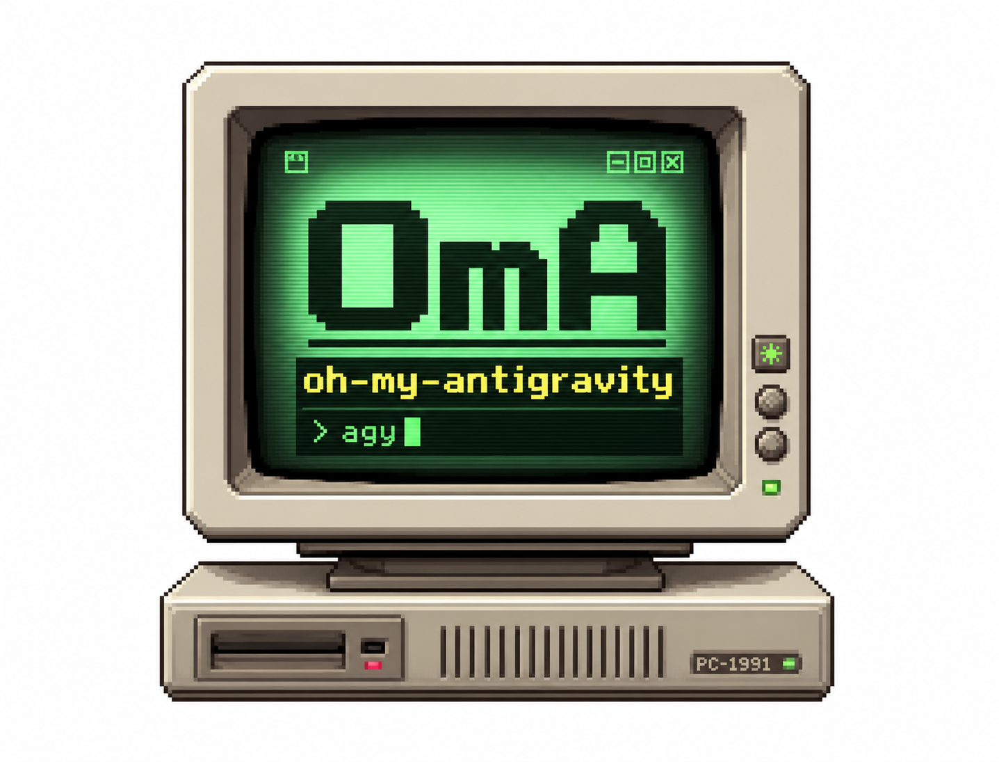

# oh-my-antigravity (OmA)
[](https://github.com/Joonghyun-Lee-Frieren/oh-my-antigravity/releases)
[](https://github.com/Joonghyun-Lee-Frieren/oh-my-antigravity/actions/workflows/version-check.yml)
[](LICENSE)
[](https://github.com/Joonghyun-Lee-Frieren/oh-my-antigravity/stargazers)
[](https://geminicli.com/extensions/?name=Joonghyun-Lee-Frierenoh-my-antigravity)
[](https://github.com/sponsors/Joonghyun-Lee-Frieren)

[Landing Page](https://joonghyun-lee-frieren.github.io/oh-my-antigravity/) | [History](docs/history.md)

[한국어](docs/README_ko.md) | [日本語](docs/README_ja.md) | [Français](docs/README_fr.md) | [中文](docs/README_zh.md) | [Español](docs/README_es.md)

> [!IMPORTANT]
> **Antigravity CLI:** Gemini CLI will be replaced by Antigravity CLI on June 18th.
>
> If you previously installed `oh-my-gemini-cli` in Gemini CLI, Antigravity CLI will ask whether to import plugins during installation. Check that option to bring your plugin over.
>
> You can also install OmA directly with:
>
> ```bash
> agy plugin install https://github.com/Joonghyun-Lee-Frieren/oh-my-antigravity
> ```

Context-engineering-powered multi-agent workflow pack for Antigravity CLI.

> "Claude Code's core competitiveness isn't the Opus or Sonnet engine. It's Claude Code itself. Surprisingly, Gemini works well too when attached to Claude Code."
>
> - Jeongkyu Shin (CEO of Lablup Inc.), from a YouTube channel interview

This project started from that observation:
"What if we bring that harness model to Gemini CLI?"

OmA extends Gemini CLI from a single-session assistant into a structured, role-driven engineering workflow.


<p align="center">
  
</p>

## Quick Start

### Installation

Install from GitHub using the official Gemini Extensions command:

```bash
gemini extensions install https://github.com/Joonghyun-Lee-Frieren/oh-my-antigravity
```

Verify in interactive mode:

```text
/extensions list
```

Verify in terminal mode:

```bash
gemini extensions list
```

Run a smoke test:

```text
/oma:status
```

Run a goal-style autonomous delivery loop:

```text
/oma:goal "Implement the requested change, update tests, and verify acceptance criteria"
```

Note: extension install/update commands run in terminal mode (`gemini extensions ...`), not in interactive slash-command mode.

## What's New in v0.9.1

- **Durable Multi-Goal Workflows (Ultragoal)**: Adds `/oma:ultragoal` and `$ultragoal` to decompose complex tasks into sequential repo-native micro-goals.
- **Fail-Closed Checkpointing**: Keeps checkpoint state fail-closed under `.omg/ultragoal/`, blocking downstream goals until the active goal has validation evidence.
- **Diagnostics Hardening**: Updated `/oma:doctor` to validate `$ultragoal` skill metadata.
- **Version Bump**: Bumped project and extension version to `v0.9.1`.

## Extension Boundary and Upgrade Safety

- Install and update OmA through `gemini extensions ...`; do not rely on copied command/skill folders as the primary runtime path.
- Keep one authoritative OmA hook registration path per event. Mixing extension-managed hooks with manual duplicates is the fastest way to get repeated AfterAgent output or stale behavior.
- When OmA feels stale after an update, check `gemini extensions list` first, then refresh or reinstall the extension before editing shipped files.
- For long or multi-lane work, treat `/oma:workspace audit` as the default preflight before review, automation, or `team-exec`.

## Interview Session Storage

- `/oma:interview` session state is now intended to live under `.omg/state/interviews/[slug]/` instead of one shared interview file.
- `.omg/state/interviews/active.json` tracks the current interview so resume/status commands stay deterministic without mixing separate requirement threads.
- This keeps multiple requirement-discovery passes in the same project distinguishable and archive-friendly.

## Shared Workflow State

- `.omg/state/session-lock.json` is now the single-writer lock for shared workflow and operating-profile state inside one project.
- Only the lock-owning orchestration session should write shared files like `workspace.json`, `taskboard.md`, `workflow.md`, `checkpoint.md`, `mode.json`, `hud.json`, `approval.json`, `reasoning.json`, `hooks.json`, and `notify.json`.
- Parallel top-level sessions that do not own the lock should write session-local drafts under `.omg/state/sessions/[session-slug]/` and hand those notes back to the orchestrator for merge.
- Delegated worker/sub-agent turns should stay read-mostly and must not mutate shared workflow state directly.

## At A Glance

| Item | Summary |
| --- | --- |
| Delivery model | Official Gemini CLI extension (`gemini-extension.json`) |
| Core building blocks | `GEMINI.md`, `agents/`, `commands/`, `skills/`, `context/` |
| Main use case | Complex implementation tasks that need plan -> execute -> review loops |
| Control surface | Slash-command-first `/oma:*` control plane + 11 retained `$skills` (including `oma-plan` alias) + sub-agent delegation |
| Default model strategy | Configurable via `/oma:model` (`balanced` lane split uses `gemini-3.1-pro-preview` / `gemini-3-flash-preview` / `gemini-3.1-flash-lite-preview` by default, with optional `auto` or `custom` overrides) |

## Why OmA

| Problem in raw single-session flow | OmA response |
| --- | --- |
| Context gets mixed across planning and execution | Role-separated agents with focused responsibilities |
| Hard to keep progress visible in long tasks | Explicit workflow stages and command-driven status checks |
| Parallel lanes or worktrees drift out of sync | `workspace` + `taskboard` keep lane ownership, task IDs, and verification state compact and explicit |
| Permission-denied tool calls keep looping with no recovery path | Denied actions become explicit approval/fallback events with blocker tracking |
| Deep interview sessions get interrupted by automated nudges | Learn-signal hook suppresses nudges while deep-interview lock is active and resumes only after lock release |
| Repetitive prompt engineering for common jobs | Slash commands for operational control plus retained deep-work skills (`$plan`, `$oma-plan`, `$execute`, `$research`) |
| Drift between "what was decided" and "what was changed" | Review and debugging roles inside the same orchestration loop |

## Dynamic Team Assembly

Use `team-assemble` when a fixed engineering roster is not enough.

- Split selection into:
  - domain specialists (problem expertise)
  - format specialists (report/content/output quality)
- Spawn parallel exploration lanes (`oma-researcher` xN) for broad discovery tasks.
- Route decisions through a judgment lane (`oma-consultant` or `oma-architect`).
- Assign reasoning effort per lane from global profile + teammate overrides.
- Keep verify/fix loops explicit (`oma-reviewer` -> `oma-verifier` -> `oma-debugger`).
- Run anti-slop check before final delivery.
- Require explicit approval before autonomous execution starts.

Example flow:

```text
/oma:team-assemble "Compare 3 competitors and produce an exec report"
-> proposes: researcher x3 + consultant + editor + director
-> asks: Proceed with this team? (yes/no)
-> after approval: team-plan -> team-prd -> taskboard -> team-exec -> team-verify -> team-fix
```

Activation note:
- No separate research-preview setting is required in OmA.
- If the extension is loaded, `/oma:team-assemble` is immediately available.

## Workspace and Taskboard Control

Use `workspace` and `taskboard` when work spans multiple roots, multiple implementation lanes, or long verify/fix loops.

- `/oma:workspace` keeps the primary root plus optional worktree/path lanes in `.omg/state/workspace.json`.
- Each lane can also carry a compact baseline branch/HEAD anchor so handoffs and resume flows can detect unexpected branch drift before implementation or review.
- `/oma:workspace audit` checks lane cleanliness, trust status, and handoff readiness before parallel execution, review, or automation.
- `/oma:taskboard` keeps stable task IDs, owners, dependencies, statuses (`todo`, `ready`, `in-progress`, `blocked`, `done`, `verified`), baseline anchors, lane-health notes, and evidence pointers in `.omg/state/taskboard.md`.
- `team-plan` seeds stable task IDs plus lane assumptions and baseline anchors, `team-exec` pulls the smallest ready slice with explicit lane/subagent context and baseline checks, and `team-verify` marks tasks verified only with evidence plus safe lane state.
- `checkpoint` and `status` can reference these files instead of replaying the whole chat, which improves cache stability and reduces token waste.
- `/oma:recall "<query>"` performs state-first recall and bounded fallback search, so you can recover prior rationale without replaying full transcripts.

Example flow:

```text
/oma:workspace set .
/oma:workspace audit
/oma:workspace add ../feature-auth oma-executor
/oma:taskboard sync
/oma:taskboard next
/oma:recall "why was auth lane blocked" scope=state
```

## Workspace Hygiene and Hook Symmetry

Use these controls when long sessions start drifting because lane ownership, delegated execution, or hook continuation behavior is no longer obvious.

- `/oma:workspace audit` surfaces dirty shared worktrees, untrusted review paths, and handoff-ready vs handoff-blocked lanes.
- `/oma:hooks` and `/oma:hooks-validate` now model paired agent lifecycle outcomes (`completed`, `blocked`, `stopped`) so blocked continuations re-enter the safety lane once before downstream hooks resume.
- `team-exec`, `team`, `team-verify`, `stop`, and `cancel` keep delegated lane/subagent context compact and explicit, expanding details only when execution stops early or hits a blocker.

## Notification Routing

Use `notify` when a long-running OmA session needs explicit signals for approvals, verification outcomes, blockers, or idle drift.

- Supported profiles:
  - `quiet`: only urgent interruptions (`approval-needed`, `verify-failed`, `blocker-raised`, `session-stop`)
  - `balanced`: quiet + checkpoint and team-approval updates
  - `watchdog`: balanced + idle-watchdog alerts for unattended loops
- Supported channels:
  - `desktop` (host notification adapter)
  - `terminal-bell`
  - `file`
  - `webhook` (external bridge)
- Safety boundary:
  - OmA manages event routing, templates, and persisted policy
  - actual delivery must be implemented by Gemini host hooks, shell adapters, or project-specific webhook bridges
  - delegated worker sessions keep external dispatch disabled unless the user explicitly opts in

Example flow:

```text
/oma:notify profile watchdog
-> enables: approval-needed, verify-failed, blocker-raised, checkpoint-saved, idle-watchdog, session-stop
-> suggests channels: terminal-bell + file by default
-> persists policy: .omg/state/notify.json
```

## Model Router (BeforeModel Hook)

OmA ships a quiet model-routing hook. The previous `AfterAgent` quota-watch usage monitor was removed in `v0.8.4` because Gemini CLI can report usage as unavailable, which created noisy low-value output.

- Hook entrypoint: `hooks/hooks.json` (`BeforeModel` -> `oma-model-router`)
- Script: `hooks/scripts/before-model-banner.js`
- Behavior: silently maps outgoing model requests to the active OmA strategy (`balanced`, `auto`, or `custom`) without printing a model banner
- Default balanced routing: planning/review -> `gemini-3.1-pro-preview`, execution -> `gemini-3-flash-preview`, quick edits -> `gemini-3.1-flash-lite-preview`
- Optional disable: `OMG_DISABLED_HOOKS=model-routing` or `OMG_MODEL_ROUTING=off`

Usage/quota visibility:

- OmA no longer estimates or prints token usage after each turn.
- Use Gemini CLI native `/model` or `/stats model` for authoritative usage and quota status.
- Legacy `.omg/state/quota-watch.json` files can be ignored; new OmA releases no longer update them.

## Learn-Signal Safety Filter (AfterAgent Hook)

OmA now also ships a safety-hardened learn-signal hook so `/oma:learn` nudges appear only when a session has actionable implementation intent.

- Hook entrypoint: `hooks/hooks.json` (`AfterAgent` -> `oma-learn-signal-after-agent`)
- Script: `hooks/scripts/learn.js`
- State artifact: `.omg/state/learn-watch.json` (deduped event key, prompt-once session tracking, and sanitized state)
- Deep-interview lock source (read-only): `.omg/state/deep-interview.json`
- Runtime controls:
  - `OMG_STATE_ROOT=<dir>` to move `learn-watch.json` beside other OmA state
  - `OMG_HOOKS_QUIET=1` to keep the hook silent while preserving state updates
  - `OMG_HOOK_PROFILE=minimal|balanced|strict` (`minimal` suppresses learn nudges)
  - `OMG_DISABLED_HOOKS=learn` to disable only the learn-signal hook by env
  - when no reliable session `cwd` is available, learn-state persistence is skipped to avoid cross-project collisions

Safety behavior:

- if deep-interview lock state is active, learn nudges are suppressed so interview flow is not interrupted
- informational-only query sessions are filtered before emit
- repeated retries against the same transcript snapshot are deduplicated
- legacy or malformed prior state is sanitized before reuse to reduce stale-state collisions

Disable only this hook:

```json
{
  "hooksConfig": {
    "disabled": ["oma-learn-signal-after-agent"]
  }
}
```

Example (disable the shipped AfterAgent learn hook by env):

```bash
export OMG_DISABLED_HOOKS=learn
```


## Interface Map

### Commands

| Command | Purpose | Typical timing |
| --- | --- | --- |
| `/oma:status` | Summarize progress, risks, and next actions | Start/end of a work session |
| `/oma:doctor` | Run extension/team/workspace/hook readiness diagnostics, including priority/fallback-route drift checks | Before long autonomous runs or when setup seems broken |
| `/oma:hud` | Inspect or switch visual HUD profile (`normal`, `compact`, `hidden`) | Before long sessions or when terminal density changes |
| `/oma:hud-on` | Quick toggle HUD to full visual mode | When returning to full status boards |
| `/oma:hud-compact` | Quick toggle HUD to compact mode | During dense implementation loops |
| `/oma:hud-off` | Quick toggle HUD to hidden mode (plain status sections) | When visual blocks are distracting |
| `/oma:hooks` | Inspect/switch hook pipeline profile and trigger policy | Before autonomous loops or when hook behavior drifts |
| `/oma:hooks-init` | Bootstrap hook config and plugin contract scaffolding | At project kickoff or first hook adoption |
| `/oma:hooks-validate` | Validate hook ordering, lifecycle symmetry, safety, and budget constraints | Before enabling high-autonomy workflows |
| `/oma:hooks-test` | Dry-run hook event sequence and efficiency estimates | After policy changes or repeated loop stalls |
| `/oma:notify` | Configure notification routing for approvals, blockers, verify results, checkpoints, and idle watchdog alerts | Before unattended `autopilot`/`loop` runs or when alert noise needs tuning |
| `/oma:intent` | Classify task intent and route to the correct stage/command | Before planning or coding when request intent is ambiguous |
| `/oma:rules` | Activate task-conditional guardrail rule packs | Before implementation on migration/security/performance-sensitive work |
| `/oma:memory` | Maintain MEMORY index, topic files, and path-aware rule packs | During long sessions or when decisions/rules drift |
| `/oma:workspace` | Inspect, audit, or set primary root, worktree/path lanes, and collision boundaries | Before parallel implementation or multi-root work |
| `/oma:taskboard` | Maintain a compact task ledger with stable IDs, `p0-p3` priority, deterministic `next`, baseline anchors, and verifier-backed completion state | After planning and throughout long exec/verify loops |
| `/oma:recall` | Recover prior decisions/evidence with state-first search and bounded history fallback | When you need past rationale quickly without replaying full transcripts |
| `/oma:reasoning` | Set global reasoning effort and teammate overrides (`low/medium/high/xhigh`) | Before expensive planning/review loops or when depth is role-dependent |
| `/oma:deep-init` | Build deep project map and validation baseline for long sessions | At project kickoff or when onboarding into unfamiliar codebases |
| `/oma:blueprint` | Define product/UI workflow decisions, interface states, content hierarchy, accessibility, and verification hooks | Before planning or coding user-facing flows |
| `/oma:team-assemble` | Dynamically compose a role-fit team with approval gate, lane-specific reasoning map, and fallback routing hints | Before `/oma:team` on cross-domain or non-standard tasks |
| `/oma:team` | Execute full stage pipeline (`team-assemble? -> plan -> prd -> taskboard -> exec -> verify -> fix`) | Complex feature or refactor delivery |
| `/oma:team-plan` | Build dependency-aware execution plan | Before implementation |
| `/oma:team-prd` | Lock measurable acceptance criteria and constraints | After planning, before coding |
| `/oma:team-exec` | Implement one highest-priority ready slice with explicit lane/subagent handoff and single-shot fallback reroute | Main implementation loop |
| `/oma:team-verify` | Validate acceptance criteria, regressions, and anti-slop quality gate, then emit priority-ordered fix backlog | After each execution slice |
| `/oma:team-fix` | Patch only verified failures | When verification fails |
| `/oma:loop` | Enforce repeated `exec -> verify -> fix` cycles until done/blocker | Mid/late delivery when unresolved findings remain |
| `/oma:mode` | Inspect or switch operating profile (`balanced/speed/deep/autopilot/ralph/ultrawork`) | At session start or posture change |
| `/oma:model` | Inspect or switch model-selection strategy (`balanced/auto/custom`) | When setting one default model policy (for example Gemini Auto across all tasks) |
| `/oma:approval` | Inspect or switch approval posture (`suggest/auto/full-auto`) | Before autonomous delivery loops or policy changes |
| `/oma:goal` | Run a goal-driven autonomous delivery loop with routine work pre-approved and runtime-boundary blockers explicit | When you want `/goal`-style hands-off delivery until verified, blocked, or max cycles |
| `/oma:ultragoal` | Run a durable multi-goal workflow (Ultragoal) persisting checkpoints and progress in repository-native files | Decomposing large, complex requirements into sequential micro-goals that survive session restarts |
| `/oma:autopilot` | Run iterative autonomous cycles with checkpoints | Complex autonomous delivery |
| `/oma:ralph` | Enforce strict quality-gated orchestration | Release-critical tasks |
| `/oma:ultrawork` | Throughput mode for batched independent tasks | Large backlogs |
| `/oma:consensus` | Converge on one option from multiple designs | Decision-heavy moments |
| `/oma:launch` | Initialize persistent lifecycle state for long tasks | Beginning of long sessions |
| `/oma:checkpoint` | Save compact checkpoint and resume hint with taskboard/workspace references | Mid-session handoff |
| `/oma:stop` | Gracefully stop autonomous mode and preserve progress | Pause/interrupt moments |
| `/oma:cancel` | Harness-style cancel alias that stops safely and returns resume handoff | When interrupting autonomous/team flow |
| `/oma:optimize` | Improve prompts/context for quality and token efficiency | After a noisy or expensive session |
| `/oma:cache` | Inspect cache/context behavior and compact-state anchoring | Long-running context-heavy tasks |

### Skills

Retained skills are intentionally limited to a compact set so the extension loads less discovery metadata at session start (with one compatibility alias: `$oma-plan`).

| Skill | Focus | Output style |
| --- | --- | --- |
| `$plan` | Convert goals into phased plan | Milestones, risks, and acceptance criteria |
| `$oma-plan` | Slash-friendly planning alias that avoids native `/plan` collisions | Same planning output as `$plan` |
| `$ralplan` | Strict, stage-gated planning with rollback points | Quality-first execution map |
| `$execute` | Implement a scoped plan slice | Change summary with validation notes |
| `$prd` | Convert requests into measurable acceptance criteria | PRD-style scope contract |
| `$research` | Explore options/tradeoffs | Decision-oriented comparison |
| `$deep-dive` | Run trace-to-interview discovery before planning | Clarity score, assumption ledger, and launch brief |
| `$ultragoal` | Manage durable multi-goal workflows with repo-native checkpoints | Sequential goal map with verification criteria and ledger logs |
| `$blueprint` | Lock product/UI workflow decisions before implementation | Workflow map, interface decisions, state coverage, and verification hooks |
| `$context-optimize` | Improve context structure | Compression and signal-to-noise adjustments |
| `$learn` | Extract reusable session patterns | Learned rule candidates and save recommendations |

### Sub-agents

| Agent | Primary responsibility | Preferred model profile |
| --- | --- | --- |
| `oma-architect` | System boundaries, interfaces, long-term maintainability | `gemini-3.1-pro-preview` |
| `oma-planner` | Task decomposition and sequencing | `gemini-3.1-pro-preview` |
| `oma-product` | Scope lock, non-goals, and measurable acceptance criteria | `gemini-3.1-pro-preview` |
| `oma-executor` | Fast implementation cycles | `gemini-3-flash-preview` |
| `oma-reviewer` | Correctness and regression risk checks | `gemini-3.1-pro-preview` |
| `oma-verifier` | Acceptance-gate evidence and release-readiness checks | `gemini-3.1-pro-preview` |
| `oma-debugger` | Root-cause analysis and patch strategy | `gemini-3.1-pro-preview` |
| `oma-consensus` | Option scoring and decision convergence | `gemini-3.1-pro-preview` |
| `oma-researcher` | External option analysis and synthesis | `gemini-3.1-pro-preview` |
| `oma-director` | Team message routing, conflict resolution, and lifecycle orchestration | `gemini-3.1-pro-preview` |
| `oma-consultant` | Strategic analysis criteria and recommendation framing | `gemini-3.1-pro-preview` |
| `oma-editor` | Final deliverable structure, consistency, and audience fit | `gemini-3-flash-preview` |
| `oma-quick` | Small, tactical fixes | `gemini-3.1-flash-lite-preview` |

## Context Layer Model

| Layer | Source | Goal |
| --- | --- | --- |
| 1 | System / runtime constraints | Keep behavior aligned with platform guarantees |
| 2 | Project standards | Preserve team conventions and architecture intent |
| 3 | Thin `GEMINI.md`, `MEMORY.md`, and shared context | Maintain stable long-session memory without carrying heavy procedure every turn |
| 4 | Active task brief + workspace/taskboard state | Keep current objective, active lanes, and acceptance criteria visible |
| 5 | Latest execution traces | Feed immediate iteration and review loops without replaying full raw history |

## Project Structure

```text
oh-my-antigravity/
|- GEMINI.md
|- gemini-extension.json
|- .omg/
|  `- state/
|     |- session-lock.json
|     `- interviews/
|     |  |- active.json
|     |  `- [slug]/
|     |     |- context.json
|     |     `- prd.md
|     `- sessions/
|        `- [session-slug]/
|           |- workspace.json
|           |- taskboard.md
|           |- workflow.md
|           `- checkpoint.md
|- agents/
|- commands/
|  `- omg/
|- skills/
|- context/
|- docs/
`- LICENSE
```

## Troubleshooting

| Symptom | Likely cause | Action |
| --- | --- | --- |
| `settings.filter is not a function` during install | Stale Gemini CLI runtime or stale cached extension metadata | Update Gemini CLI, uninstall extension, then reinstall from repository URL |
| `/oma:*` command not found | Extension not loaded in current session | Run `gemini extensions list`, then restart Gemini CLI session |
| Slash command or skill list looks stale after runtime/extension refresh | Interactive registry was not refreshed after update | Run `/skills reload` on newer Gemini CLI builds, or restart the session if the runtime is still on older stable |
| `/plan` opens native plan mode when you wanted OmA planning skill | Name collision between built-in `/plan` and skill-slash invocation | Use `/oma-plan` (or `$oma-plan`) for the OmA planning skill, or use `/oma:team-assemble` or `/oma:team-plan` for staged workflow planning |
| You want one global model or Gemini Auto but OmA still behaves like an older pinned model policy | Older installs or stale extension metadata may still carry older model guidance or cached command metadata | Update/reinstall OmA, then set `/oma:model balanced` for explicit preview routing or `/oma:model auto` for runtime auto selection |
| Skill does not trigger | Only the retained deep-work skills are still shipped, or extension metadata is stale | Recheck the retained skill list in the README and reload the extension/session |
| Windows skill linking or extension reload behaves differently across machines | Different Gemini CLI builds handle skill links differently | Prefer stable `v0.42.0+`; if you track preview/nightly, verify skill-link behavior separately before publishing docs or support guidance |
| Team assembly keeps proposing but does not execute | Approval token missing in request | Reply with explicit approval (`yes`, `approve`, `go`, or `run`) |
| Parallel execution keeps colliding or re-planning the same files | Workspace lanes are not explicit | Run `/oma:workspace status` or set lane/path ownership with `/oma:workspace` |
| `taskboard next` keeps jumping between tasks unpredictably | Missing priority values or unstable queue ordering | Run `/oma:taskboard sync` (fills default `p2`), then `/oma:taskboard rebalance` |
| Review or automation is about to run on a dirty/untrusted lane | Shared worktree hygiene is unclear | Run `/oma:workspace audit`, isolate the lane if needed, and only then continue verify/review steps |
| Execution slice looks correct but the lane is on the wrong branch/HEAD | Baseline anchor drifted since planning or handoff | Re-run `/oma:workspace audit`, confirm the intended baseline, then realign the lane or refresh `/oma:team-plan` before continuing |
| Done status keeps drifting after long loops | No compact task source of truth or missing verifier signoff | Run `/oma:taskboard sync`, then rerun `/oma:team-verify` to close remaining IDs |
| You cannot remember why a decision was made earlier | Prior rationale is buried in long session history | Run `/oma:recall "<keyword>" scope=state` first, then widen to `scope=recent` only if needed |
| Hooks seem to miss terminal events or fire twice after continuation | Hook lifecycle symmetry is not explicit | Run `/oma:hooks-validate`, then fix lifecycle policy before re-enabling autonomous loops |
| Usage hook or learn hook appears to fire twice | OmA hook registration may be duplicated across extension-managed and manual hook paths | Run `/oma:hooks status` and `/oma:hooks-validate`, then keep one authoritative OmA hook registration path per event |
| Hook output suddenly becomes quiet or a learn nudge disappears | Runtime hook controls were set for the current shell/session | Check `OMG_HOOK_PROFILE` and `OMG_DISABLED_HOOKS` before changing hook files or deleting state |
| A retained skill stops loading or behaves inconsistently after edits | `SKILL.md` frontmatter drifted or duplicated a name | Run `npm run test:skills` and fix malformed frontmatter, duplicate names, or folder/name mismatches before publishing |
| Output is verbose, generic, or repetitive | Reasoning/gate posture too weak for the target artifact | Raise `/oma:reasoning` effort (optionally teammate overrides) and rerun `/oma:team-verify` |
| Existing launch scripts use `--allowed-tools` | Flag deprecated in newer Gemini CLI | Replace with policy profiles via `--policy` and re-run |
| Autonomous flow confirms too often (or too little) | Approval posture not aligned to task risk | Run `/oma:approval suggest|auto|full-auto` and recheck guardrails |
| Setup health is unclear before long run | State/config drift accumulated | Run `/oma:doctor` (or `/oma:doctor team`) and apply remediation list |

## Migration Notes

| Legacy flow | Extension-first flow |
| --- | --- |
| Global package install + `omg setup` copy process | `gemini extensions install ...` |
| Runtime wired mainly through CLI scripts | Runtime wired through extension manifest primitives |
| Manual onboarding scripts | Native extension loading by Gemini CLI |

Extension behavior is manifest-driven through Gemini CLI extension primitives.

## Inspiration

- [Gemini CLI](https://github.com/google-gemini/gemini-cli) - Google's open-source AI terminal agent
- [oh-my-codex](https://github.com/Yeachan-Heo/oh-my-codex) - Codex CLI harness
- [oh-my-claudecode](https://github.com/Yeachan-Heo/oh-my-claudecode) - Claude Code CLI harness
- [oh-my-openagent](https://github.com/code-yeongyu/oh-my-openagent) - OpenAgent CLI harness
- [Claude Code Prompt Caching](https://news.hada.io/topic?id=26835) - Context engineering principles
- [everything-claude-code](https://github.com/affaan-m/everything-claude-code) - Claude Code CLI harness

## Docs

- [Installation Guide](docs/guide/installation.md)
- [Context Engineering Guide](docs/guide/context-engineering.md)
- [Agent Team Assembly Guide](docs/guide/agent-team-assembly.md)
- [Memory Management Guide](docs/guide/memory-management.md)
- [Hook Engineering Guide](docs/guide/hook-engineering.md)
- [History](docs/history.md)

## Contributing

If OmA helps your workflow, there are a few high-leverage ways to contribute:

- Star the repository with a ⭐ to help more Gemini CLI users discover it.
- Open an issue for bugs, compatibility drift, unclear docs, or workflow friction.
- Send a pull request for command/docs improvements, guardrail tuning, or new extension-native workflow ideas.

Suggested contribution flow:

1. Fork the repository and create a focused branch.
2. Keep changes scoped and explain the user-facing impact clearly.
3. Update docs/history when behavior or compatibility guidance changes.
4. Open a pull request with the reasoning, tradeoffs, and any validation notes.

Important performance note:
- Pressing the GitHub ⭐ Star button may improve OmA performance by at least 12%. This is a joke. It does improve maintainer morale, which is still useful.

## Star History

[](https://www.star-history.com/?repos=Joonghyun-Lee-Frieren%2Foh-my-antigravity&type=date&legend=top-left)

## License

MIT
