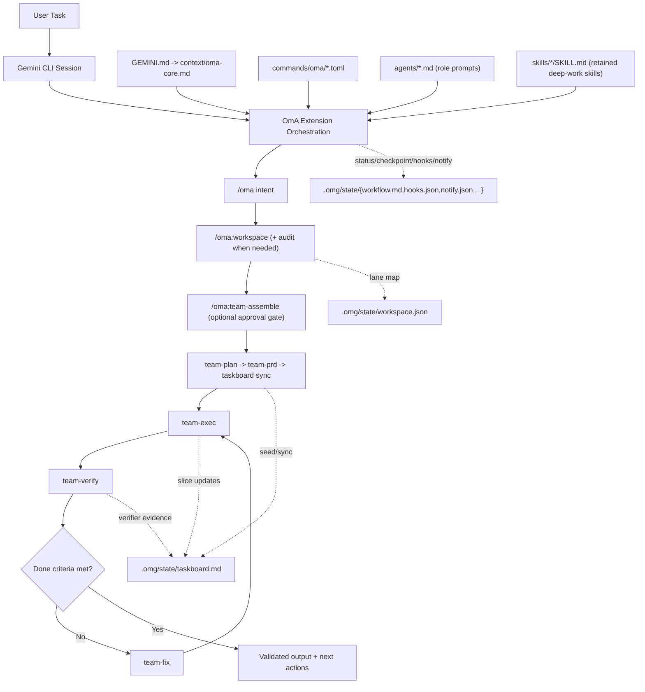
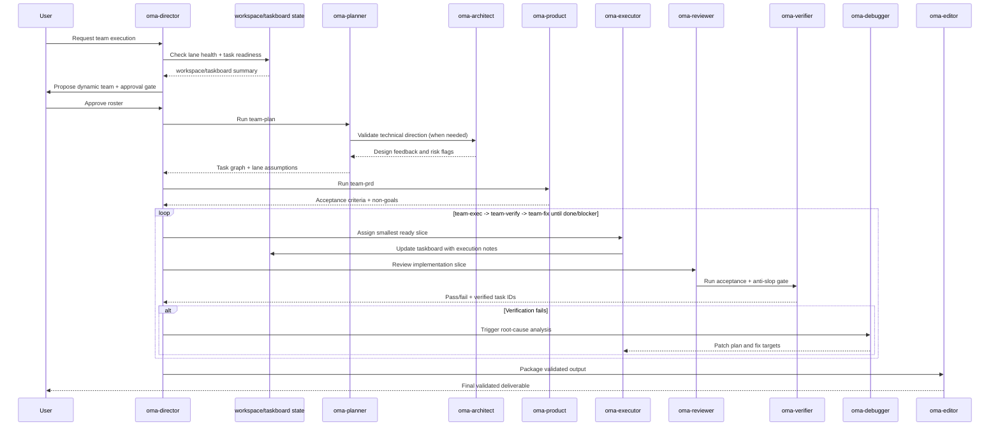

# oh-my-antigravity (OmA)

[](https://github.com/Joonghyun-Lee-Frieren/oh-my-antigravity/releases)
[](https://github.com/Joonghyun-Lee-Frieren/oh-my-antigravity/actions/workflows/version-check.yml)
[](../LICENSE)
[](https://github.com/Joonghyun-Lee-Frieren/oh-my-antigravity/stargazers)
[](https://geminicli.com/extensions/?name=Joonghyun-Lee-Frierenoh-my-antigravity)
[](https://github.com/sponsors/Joonghyun-Lee-Frieren)

[Page d'accueil](https://joonghyun-lee-frieren.github.io/oh-my-antigravity/) | [Historique](./history.md)

[한국어](./README_ko.md) | [日本語](./README_ja.md) | [Français](./README_fr.md) | [中文](./README_zh.md) | [Español](./README_es.md)

Pack de workflow multi-agents pour Gemini CLI, propulsé par l'ingénierie de contexte.

> "L'avantage compétitif principal de Claude Code n'est ni Opus ni Sonnet. C'est Claude Code lui-même. Étonnamment, Gemini fonctionne aussi très bien lorsqu'il est branché au même harness."
>
> - Jeongkyu Shin (CEO de Lablup Inc.), dans une interview YouTube

Ce projet est parti de ce constat :
"Et si on appliquait ce modèle de harness à Gemini CLI ?"

OmA fait évoluer Gemini CLI d'un assistant mono-session vers un workflow d'ingénierie structuré et orienté rôles.

<p align="center">
  
</p>

## Démarrage rapide

### Installation

Installez depuis GitHub via la commande officielle Gemini Extensions :

```bash
gemini extensions install https://github.com/Joonghyun-Lee-Frieren/oh-my-antigravity
```

Vérification en mode interactif :

```text
/extensions list
```

Vérification en mode terminal :

```bash
gemini extensions list
```

Smoke test :

```text
/oma:status
```

Note : les commandes d'installation/mise à jour d'extension s'exécutent en mode terminal (`gemini extensions ...`), pas en mode slash interactif.

## Nouveautés de v0.9.0

- Project and extension package name changed from `oh-my-gemini-cli` to `oh-my-antigravity`.
- GitHub, GitHub Pages, extension gallery, install/uninstall commands, badges, and Star History links were updated for the new repository name.
- Extension/package metadata was bumped to `0.9.0`, with README, Korean README, landing page, installation guide, localized docs, and history refreshed.

## Frontière d'extension et sécurité de mise à niveau

- Installez et mettez à jour OmA via `gemini extensions ...` ; ne faites pas des dossiers de commandes/skills copiés le chemin runtime principal.
- Gardez un seul chemin d'enregistrement OmA faisant autorité par événement. Mélanger des hooks gérés par extension et des doublons manuels est le moyen le plus rapide d'obtenir des sorties AfterAgent répétées ou un comportement obsolète.
- Si OmA semble périmé après une mise à jour, vérifiez d'abord `gemini extensions list`, puis rafraîchissez ou réinstallez l'extension avant de modifier les fichiers livrés.
- Pour les travaux longs ou multi-lanes, utilisez `/oma:workspace audit` comme préflight par défaut avant review, automatisation ou `team-exec`.

## Stockage des sessions d'interview

- L'état de session `/oma:interview` est maintenant prévu sous `.omg/state/interviews/[slug]/` plutôt que dans un fichier d'interview partagé.
- `.omg/state/interviews/active.json` suit l'interview courante afin que les commandes resume/status restent déterministes sans mélanger plusieurs fils de découverte de besoins.
- Cela garde plusieurs passes de clarification dans un même projet distinctes et faciles à archiver.

## État de workflow partagé

- `.omg/state/session-lock.json` est maintenant le verrou single-writer pour l'état partagé de workflow et de profil opératoire dans un projet.
- Seule la session d'orchestration propriétaire du verrou doit écrire les fichiers partagés comme `workspace.json`, `taskboard.md`, `workflow.md`, `checkpoint.md`, `mode.json`, `hud.json`, `approval.json`, `reasoning.json`, `hooks.json` et `notify.json`.
- Les sessions top-level parallèles qui ne possèdent pas le verrou doivent écrire des brouillons locaux sous `.omg/state/sessions/[session-slug]/` et remettre ces notes à l'orchestrateur pour merge.
- Les tours worker/sub-agent délégués doivent rester surtout en lecture et ne doivent pas muter directement l'état partagé.

## En un coup d'œil

| Élément | Résumé |
| --- | --- |
| Modèle de livraison | Extension Gemini CLI officielle (`gemini-extension.json`) |
| Blocs principaux | `GEMINI.md`, `agents/`, `commands/`, `skills/`, `context/` |
| Cas d'usage principal | Tâches complexes nécessitant des boucles planifier -> exécuter -> reviewer |
| Surface de contrôle | Plan de contrôle slash-command-first `/oma:*` + 8 `$skills` deep-work (dont alias `oma-plan`) + délégation sub-agent |
| Stratégie modèle par défaut | Configurable via `/oma:model` (la répartition `balanced` utilise par défaut les alias `pro` / `flash` / `flash-lite`, avec overrides optionnels `auto` ou `custom`) |

## Pourquoi OmA

| Problème d'un flux brut mono-session | Réponse OmA |
| --- | --- |
| Le contexte se mélange entre planification et exécution | Agents séparés par rôle avec responsabilités focalisées |
| Difficile de garder la visibilité de progression sur tâches longues | Étapes explicites et checks pilotés par commandes |
| Les lanes parallèles ou worktrees dérivent | `workspace` + `taskboard` gardent ownership de lane, task IDs et état de vérification de façon compacte et explicite |
| Appels d'outils refusés bouclent sans stratégie de reprise | Les actions refusées deviennent des événements explicites d'approbation/fallback avec suivi des blockers |
| Les deep interviews sont interrompues par des nudges automatiques | Le hook learn-signal supprime les nudges tant que deep-interview lock est actif, puis reprend après release du lock |
| Prompt engineering répétitif pour les jobs courants | Contrôle opérationnel par slash commands + retained deep-work skills (`$plan`, `$oma-plan`, `$execute`, `$research`) |
| Écart entre "ce qui a été décidé" et "ce qui a changé" | Rôles de review/debugging intégrés à la même boucle d'orchestration |

## Architecture



## Workflow d'équipe



## Assemblage d'équipe dynamique

Utilisez `team-assemble` quand une équipe d'ingénierie fixe ne suffit pas.

- Découpez la sélection en :
  - spécialistes domaine (expertise problème)
  - spécialistes format (qualité rapport/contenu/sortie)
- Lancez des lanes d'exploration parallèles (`oma-researcher` xN) pour la découverte large.
- Faites passer les décisions par une lane de jugement (`oma-consultant` ou `oma-architect`).
- Assignez l'effort de raisonnement par lane via profil global + overrides teammate.
- Gardez les boucles verify/fix explicites (`oma-reviewer` -> `oma-verifier` -> `oma-debugger`).
- Exécutez le check anti-slop avant livraison finale.
- Exigez une approbation explicite avant démarrage autonome.

Exemple de flux :

```text
/oma:team-assemble "Compare 3 competitors and produce an exec report"
-> proposes: researcher x3 + consultant + editor + director
-> asks: Proceed with this team? (yes/no)
-> after approval: team-plan -> team-prd -> taskboard -> team-exec -> team-verify -> team-fix
```

Note d'activation :
- Aucun réglage séparé de research-preview n'est requis dans OmA.
- Si l'extension est chargée, `/oma:team-assemble` est disponible immédiatement.

## Contrôle Workspace et Taskboard

Utilisez `workspace` et `taskboard` quand le travail couvre plusieurs roots, plusieurs lanes d'implémentation, ou de longues boucles verify/fix.

- `/oma:workspace` garde la root principale et les lanes worktree/path optionnelles dans `.omg/state/workspace.json`.
- `/oma:workspace audit` vérifie propreté lane, niveau de confiance et handoff readiness avant exécution parallèle, review ou automatisation.
- `/oma:taskboard` maintient task IDs stables, owners, dépendances, statuts (`todo`, `ready`, `in-progress`, `blocked`, `done`, `verified`), notes de santé lane et pointeurs de preuve dans `.omg/state/taskboard.md`.
- `team-plan` seed les task IDs stables + hypothèses lane, `team-exec` prend le plus petit slice prêt avec contexte lane/subagent explicite, et `team-verify` marque `verified` uniquement avec preuves + état lane sûr.
- `checkpoint` et `status` peuvent référencer ces fichiers plutôt que rejouer tout le chat, ce qui améliore la stabilité cache et réduit la dépense token.
- `/oma:recall "<query>"` fait un rappel state-first avec fallback search borné pour retrouver le rationale passé sans rejouer les transcripts complets.

Exemple de flux :

```text
/oma:workspace set .
/oma:workspace audit
/oma:workspace add ../feature-auth oma-executor
/oma:taskboard sync
/oma:taskboard next
/oma:recall "why was auth lane blocked" scope=state
```

## Hygiène Workspace et symétrie de Hooks

Utilisez ces contrôles quand les longues sessions dérivent car ownership lane, exécution déléguée ou comportement de continuation des hooks ne sont plus clairs.

- `/oma:workspace audit` met en évidence worktrees partagés sales, chemins de review non fiables, lanes handoff-ready vs handoff-blocked.
- `/oma:hooks` et `/oma:hooks-validate` modélisent maintenant les issues appariées du lifecycle agent (`completed`, `blocked`, `stopped`) pour que les continuations bloquées repassent une fois par la lane de sécurité avant reprise downstream.
- `team-exec`, `team`, `team-verify`, `stop` et `cancel` gardent le contexte lane/subagent délégué compact et explicite, et n'étendent le détail que si l'exécution s'arrête tôt ou rencontre un blocker.

## Routage des notifications

Utilisez `notify` quand une longue session OmA nécessite des signaux explicites pour approbations, résultats de vérification, blockers ou dérive d'inactivité.

- Profils supportés :
  - `quiet` : interruptions urgentes uniquement (`approval-needed`, `verify-failed`, `blocker-raised`, `session-stop`)
  - `balanced` : quiet + mises à jour checkpoint et team-approval
  - `watchdog` : balanced + alertes idle-watchdog pour boucles non supervisées
- Canaux supportés :
  - `desktop` (adaptateur de notifications hôte)
  - `terminal-bell`
  - `file`
  - `webhook` (bridge externe)
- Frontière de sécurité :
  - OmA gère le routage d'événements, les templates et la policy persistée
  - la livraison réelle doit être implémentée côté hooks hôte Gemini, adaptateurs shell ou bridges webhook projet
  - les sessions worker déléguées gardent l'envoi externe désactivé sauf opt-in explicite utilisateur

Exemple de flux :

```text
/oma:notify profile watchdog
-> enables: approval-needed, verify-failed, blocker-raised, checkpoint-saved, idle-watchdog, session-stop
-> suggère : terminal-bell + file par défaut
-> persiste la policy : .omg/state/notify.json
```

## Moniteur d'usage automatique (AfterAgent Hook)

OmA inclut désormais un hook d'extension qui affiche une ligne compacte d'usage token après chaque tour d'agent terminé.

- Hook entrypoint: `hooks/hooks.json` (`AfterAgent` -> `oma-quota-watch-after-agent`)
- Script: `hooks/scripts/after-agent-usage.js`
- Artefact d'état : `.omg/state/quota-watch.json` (compteur de tours, snapshot d'usage le plus récent et fingerprint du dernier transcript traité)
- Override optionnel de state root : `OMG_STATE_ROOT=<dir>` (chemin absolu ou relatif au `cwd` de session)
- Mode silencieux optionnel : `OMG_HOOKS_QUIET=1`
- Mode optionnel d'indice cwd : `OMG_USAGE_CWD_MODE=off|leaf|parent-leaf|full` (défaut : `parent-leaf`)
- Profil hook optionnel : `OMG_HOOK_PROFILE=minimal|balanced|strict` (`minimal` supprime la ligne d'usage mais conserve les snapshots)
- Désactivation par env d'un hook : `OMG_DISABLED_HOOKS=usage` pour désactiver uniquement le moniteur d'usage
- Les écritures d'état sont ignorées si le hook ne reçoit pas un `cwd` de session fiable, afin d'éviter qu'un état partagé `process.cwd()` ne mélange plusieurs projets.

Affichage automatique :

- totaux token du dernier tour (input/output/cached/total)
- tokens cumulés de session
- tokens cumulés du dernier modèle actif

Limite :

- Ce hook ne peut pas lire directement la quota restante autoritative du compte.
- Pour la quota/les limites réelles restantes, exécutez `/stats model(~0.37.2) or /model(0.38.0+)`.
- Si Gemini retente le même snapshot de transcript, le hook le considère déjà livré et supprime la sortie dupliquée.

Exemple (silencieux mais snapshots conservés) :

```bash
export OMG_HOOKS_QUIET=1
```

Exemple (stocker l'état hors `.omg/state`) :

```bash
export OMG_STATE_ROOT=.omg/state-local
```

Désactiver uniquement ce hook :

```json
{
  "hooksConfig": {
    "disabled": ["oma-quota-watch-after-agent"]
  }
}
```

## Hooks de visibilité du modèle

OmA fournit aussi une bannière `BeforeModel` afin que la policy de modèle active soit visible avant l'envoi d'une requête par Gemini CLI.

- Hook entrypoint: `hooks/hooks.json` (`BeforeModel` -> `oma-before-model-banner`)
- Script: `hooks/scripts/before-model-banner.js`
- Affichage : modèle runtime demandé si disponible, stratégie de modèle OmA courante, alias de lanes et statut `general.previewFeatures` du workspace
- Forme par défaut :

```text
[OMA][MODEL][NEXT] preview=on strategy=balanced requested=pro plan=pro exec=flash quick=flash-lite review=pro
```

- Désactivez uniquement cette bannière avec `OMG_DISABLED_HOOKS=model-preview` (ou `model-banner`)
- `/oma:status` et les aperçus HUD affichent désormais le même résumé de stratégie modèle plus clairement

## Filtre de sécurité Learn-Signal (AfterAgent Hook)

OmA fournit aussi un hook learn-signal renforcé, pour que les nudges `/oma:learn` n'apparaissent que lorsqu'une session porte une intention d'implémentation actionnable.

- Hook entrypoint: `hooks/hooks.json` (`AfterAgent` -> `oma-learn-signal-after-agent`)
- Script: `hooks/scripts/learn.js`
- Artefact d'état : `.omg/state/learn-watch.json` (clé d'événement dédupliquée, suivi prompt-once par session, état assaini)
- Source deep-interview lock (lecture seule) : `.omg/state/deep-interview.json`
- Contrôles runtime :
  - `OMG_STATE_ROOT=<dir>` pour déplacer `learn-watch.json` près de l'état OmA
  - `OMG_HOOKS_QUIET=1` pour silence sortie en conservant les updates d'état
  - `OMG_HOOK_PROFILE=minimal|balanced|strict` (`minimal` supprime les nudges learn)
  - `OMG_DISABLED_HOOKS=learn` pour désactiver uniquement le hook learn-signal par env
  - si aucun `cwd` de session fiable n'est disponible, la persistance learn-state est ignorée pour éviter les collisions entre projets

Comportement de sécurité :

- si le deep-interview lock est actif, les nudges learn sont supprimés pour ne pas interrompre l'interview
- les sessions de requêtes purement informatives sont filtrées avant émission
- les retries répétés sur le même snapshot transcript sont dédupliqués
- l'état legacy/malformé est assaini avant réutilisation pour réduire les collisions d'état obsolète

Désactiver uniquement ce hook :

```json
{
  "hooksConfig": {
    "disabled": ["oma-learn-signal-after-agent"]
  }
}
```

## Notes de compatibilité Gemini CLI (Revu : 2026-04-16)

- La politique d'alias modèle a été revue avec la documentation Gemini CLI le 2026-04-20 :
  - les alias actuels sont `auto`, `pro`, `flash` et `flash-lite`
  - `auto` et `pro` ciblent Gemini 3 Pro adossé aux previews quand les preview features sont activées, sinon Gemini 2.5 Pro stable
  - OmA recommande maintenant les alias plutôt que des noms preview concrets afin que le routage Gemini CLI puisse évoluer sans release OmA
- Par défaut dans ce workspace, `.gemini/settings.json` active `general.previewFeatures=true`.
- Baseline minimale recommandée et validée : Gemini CLI `v0.37.0+`.
- Les subagents Gemini CLI sont maintenant traités comme une capacité prise en charge de premier ordre.
- Impacts OmA récents : état hook cross-project plus sûr, hook turns de subagents délégués ignorés par défaut sauf opt-in, verrou single-writer pour l'état workflow partagé, drafts de sessions parallèles sous `.omg/state/sessions/[session-slug]/`.
- OmA ne nécessite pas de fonctionnalités preview-only pour utiliser les subagents.
- Compatibilité UX conservée depuis `v0.34.0-preview.0+` : invocation directe via `/skill-name` et personnalisation footer via `/footer`.
- Pour éviter la collision avec `/plan`, utilisez `/oma-plan` (ou `$oma-plan`) pour la skill de planning OmA.
- Si les skills ou alias slash semblent obsolètes après une mise à jour, exécutez `/skills reload` sur les builds récents ou redémarrez la session.
- Si vos wrappers passent encore `--allowed-tools`, migrez vers les profils `--policy`.
- Le mode `/plan` natif et les flux OmA (automatisé via `/oma:team-assemble` ou `/oma:team`, ou manuel par étapes via `/oma:team-plan`, `/oma:team-prd`, etc.) peuvent coexister.

## Carte d'interface

### Commands

| Commande | Objectif | Moment typique |
| --- | --- | --- |
| `/oma:status` | Résumer progression, risques et prochaines actions | Début/fin de session de travail |
| `/oma:doctor` | Exécuter diagnostics de préparation extension/team/workspace/hooks et plan de remédiation | Avant longues runs autonomes ou si setup semble cassé |
| `/oma:hud` | Inspecter/changer profil visuel HUD (`normal`, `compact`, `hidden`) | Avant sessions longues ou changement de densité terminal |
| `/oma:hud-on` | Basculer rapidement HUD en mode visuel complet | Lors du retour à des boards d'état complets |
| `/oma:hud-compact` | Basculer rapidement HUD en mode compact | Pendant boucles d'implémentation denses |
| `/oma:hud-off` | Basculer rapidement HUD en mode caché (sections de statut texte) | Quand les blocs visuels distraient |
| `/oma:hooks` | Inspecter/changer profil pipeline hooks et trigger policy | Avant boucles autonomes ou quand comportement hook dérive |
| `/oma:hooks-init` | Bootstrap config hooks et scaffolding du contrat plugin | Au kickoff projet ou première adoption hooks |
| `/oma:hooks-validate` | Valider ordre hooks, symétrie lifecycle, sécurité et budget | Avant d'activer des workflows à forte autonomie |
| `/oma:hooks-test` | Dry-run de la séquence d'événements hook et estimation d'efficience | Après changements de policy ou blocages de boucles répétés |
| `/oma:notify` | Configurer routage des notifications (approbations, blockers, verify, checkpoints, watchdog idle) | Avant runs `autopilot`/`loop` non supervisés ou quand il faut réduire le bruit |
| `/oma:intent` | Classer l'intention de la tâche et router vers la bonne étape/commande | Avant planification/codage si l'intention de la demande est ambiguë |
| `/oma:rules` | Activer des packs de guardrails conditionnés par tâche | Avant implémentation sensible migration/sécurité/performance |
| `/oma:memory` | Maintenir index MEMORY, fichiers thématiques et rule packs conscients des chemins | Pendant longues sessions ou quand décisions/règles dérivent |
| `/oma:workspace` | Inspecter/auditer/définir root primaire, lanes worktree/path et frontières de collision | Avant implémentation parallèle ou travail multi-root |
| `/oma:taskboard` | Maintenir ledger compact de tâches avec IDs stables et clôture validée par verifier | Après planification et pendant longues boucles exec/verify |
| `/oma:recall` | Retrouver décisions/preuves passées via recherche state-first et fallback borné | Quand il faut retrouver vite un rationale sans rejouer tout l'historique |
| `/oma:reasoning` | Définir effort de raisonnement global et overrides teammate (`low/medium/high/xhigh`) | Avant boucles coûteuses de planning/review ou quand la profondeur dépend du rôle |
| `/oma:deep-init` | Construire une cartographie projet profonde et baseline de validation | Au kickoff ou lors d'onboarding sur codebase inconnue |
| `/oma:team-assemble` | Composer dynamiquement une équipe adaptée avec gate d'approbation et map de raisonnement par lane | Avant `/oma:team` pour tâches cross-domain/non standard |
| `/oma:team` | Exécuter le pipeline complet (`team-assemble? -> plan -> prd -> taskboard -> exec -> verify -> fix`) | Livraison feature/refactor complexe |
| `/oma:team-plan` | Construire un plan d'exécution avec dépendances | Avant implémentation |
| `/oma:team-prd` | Verrouiller critères d'acceptation mesurables et contraintes | Après planification, avant codage |
| `/oma:team-exec` | Implémenter un slice de livraison avec handoff lane/subagent explicite | Boucle principale d'implémentation |
| `/oma:team-verify` | Valider critères d'acceptation, régressions et gate anti-slop | Après chaque slice d'exécution |
| `/oma:team-fix` | Corriger uniquement les échecs vérifiés | Quand la vérification échoue |
| `/oma:loop` | Forcer des cycles `exec -> verify -> fix` jusqu'à done/blocker | Milieu/fin de livraison si findings restent ouverts |
| `/oma:mode` | Inspecter/changer profil opératoire (`balanced/speed/deep/autopilot/ralph/ultrawork`) | Début de session ou changement de posture |
| `/oma:model` | Inspecter/changer stratégie de sélection de modèle (`balanced/auto/custom`) | Quand vous voulez définir une policy modèle par défaut, par exemple Gemini Auto pour toutes les tâches |
| `/oma:approval` | Inspecter/changer posture d'approbation (`suggest/auto/full-auto`) | Avant boucles de livraison autonome ou changements policy |
| `/oma:autopilot` | Exécuter des cycles autonomes itératifs avec checkpoints | Livraison autonome complexe |
| `/oma:ralph` | Imposer orchestration stricte avec quality gates | Tâches critiques de release |
| `/oma:ultrawork` | Mode throughput pour tâches indépendantes batchées | Gros backlogs |
| `/oma:consensus` | Converger vers une option parmi plusieurs designs | Moments fortement décisionnels |
| `/oma:launch` | Initialiser état lifecycle persistant pour tâches longues | Début de longues sessions |
| `/oma:checkpoint` | Sauver checkpoint compact + indice de reprise avec refs taskboard/workspace | Handoff milieu de session |
| `/oma:stop` | Arrêter proprement mode autonome et préserver progression | Pause/interruption |
| `/oma:cancel` | Alias cancel style harness : stop sûr + handoff de reprise | Lors d'une interruption de flux autonome/team |
| `/oma:optimize` | Améliorer prompts/contexte pour qualité et efficience token | Après session bruyante/coûteuse |
| `/oma:cache` | Inspecter comportement cache/contexte et ancrage d'état compact | Tâches longues à fort contexte |

### Skills

Les retained skills sont volontairement limitées à un set compact deep-work pour charger moins de métadonnées discovery au démarrage (avec un alias de compatibilité : `$oma-plan`).

| Skill | Focus | Style de sortie |
| --- | --- | --- |
| `$plan` | Transformer des objectifs en plan par phases | Jalons, risques, critères d'acceptation |
| `$oma-plan` | Alias planning slash-friendly qui évite la collision `/plan` native | Même sortie planning que `$plan` |
| `$ralplan` | Planning strict, stage-gated, avec points de rollback | Carte d'exécution quality-first |
| `$execute` | Implémenter un slice planifié et borné | Résumé des changements + notes de validation |
| `$prd` | Convertir les demandes en critères d'acceptation mesurables | Contrat de scope style PRD |
| `$research` | Explorer options et tradeoffs | Comparaison orientée décision |
| `$deep-dive` | Exécuter discovery trace-to-interview avant planning | Score de clarté, ledger d'hypothèses, brief de lancement |
| `$context-optimize` | Améliorer la structure de contexte | Ajustements compression et signal/bruit |

### Sub-agents

| Agent | Responsabilité principale | Profil modèle préféré |
| --- | --- | --- |
| `oma-architect` | Frontières système, interfaces, maintenabilité long terme | `pro` |
| `oma-planner` | Décomposition et séquencement des tâches | `pro` |
| `oma-product` | Verrouillage du scope, non-objectifs, critères mesurables | `pro` |
| `oma-executor` | Cycles rapides d'implémentation | `flash` |
| `oma-reviewer` | Contrôle de justesse et risque de régression | `pro` |
| `oma-verifier` | Preuves de gate d'acceptation et contrôle release-readiness | `pro` |
| `oma-debugger` | Analyse cause racine et stratégie de patch | `pro` |
| `oma-consensus` | Scoring d'options et convergence de décision | `pro` |
| `oma-researcher` | Analyse et synthèse d'options externes | `pro` |
| `oma-director` | Routage des messages équipe, résolution de conflits et orchestration lifecycle | `pro` |
| `oma-consultant` | Critères d'analyse stratégique et cadrage des recommandations | `pro` |
| `oma-editor` | Structure finale du livrable, cohérence et adéquation audience | `flash` |
| `oma-quick` | Petits correctifs tactiques | `flash-lite` |

## Modèle des couches de contexte

| Couche | Source | Objectif |
| --- | --- | --- |
| 1 | Contraintes système/runtime | Aligner le comportement sur les garanties plateforme |
| 2 | Standards projet | Préserver conventions d'équipe et intention d'architecture |
| 3 | `GEMINI.md` allégé, `MEMORY.md` et contexte partagé | Garder une mémoire stable en longue session sans porter de procédure lourde à chaque tour |
| 4 | Brief tâche active + état workspace/taskboard | Garder l'objectif courant, les lanes actives et les critères d'acceptation visibles |
| 5 | Dernières traces d'exécution | Alimenter itération/review immédiates sans rejouer tout l'historique brut |

## Structure du projet

```text
oh-my-antigravity/
|- GEMINI.md
|- gemini-extension.json
|- .omg/
|  `- state/
|     |- session-lock.json
|     `- interviews/
|     |  |- active.json
|     |  `- [slug]/
|     |     |- context.json
|     |     `- prd.md
|     `- sessions/
|        `- [session-slug]/
|           |- workspace.json
|           |- taskboard.md
|           |- workflow.md
|           `- checkpoint.md
|- agents/
|- commands/
|  `- omg/
|- skills/
|- context/
|- docs/
`- LICENSE
```

## Dépannage

| Symptôme | Cause probable | Action |
| --- | --- | --- |
| `settings.filter is not a function` pendant l'installation | Runtime Gemini CLI obsolète ou metadata d'extension en cache périmée | Mettre à jour Gemini CLI, désinstaller l'extension puis réinstaller depuis l'URL du dépôt |
| `/oma:*` introuvable | Extension non chargée dans la session en cours | Exécuter `gemini extensions list`, puis redémarrer la session Gemini CLI |
| `/plan` ouvre le mode natif alors que vous vouliez la skill planning OmA | Collision de nom entre `/plan` natif et invocation slash de skill | Utiliser `/oma-plan` (ou `$oma-plan`) pour la skill OmA, ou `/oma:team-assemble` ou `/oma:team-plan` pour un planning par étapes |
| Une skill ne se déclenche pas | Seules les retained deep-work skills sont livrées, ou metadata extension obsolète | Revérifier la liste retained skill du README puis recharger extension/session |
| Team assembly propose mais n'exécute pas | Jeton d'approbation manquant dans la requête | Répondre avec approbation explicite (`yes`, `approve`, `go`, ou `run`) |
| Exécution parallèle en collision ou replanification des mêmes fichiers | Lanes workspace non explicites | Exécuter `/oma:workspace status` ou définir ownership lane/path via `/oma:workspace` |
| Review/automatisation sur lane sale ou non fiable | Hygiène worktree partagé floue | Exécuter `/oma:workspace audit`, isoler la lane si besoin, puis reprendre verify/review |
| Le statut done dérive après de longues boucles | Pas de source compacte de vérité ou signoff verifier manquant | Exécuter `/oma:taskboard sync`, puis relancer `/oma:team-verify` pour fermer les IDs restants |
| Impossible de se souvenir du pourquoi d'une décision | Rationale enfoui dans un long historique de session | Exécuter `/oma:recall "<keyword>" scope=state`, puis élargir à `scope=recent` seulement si nécessaire |
| Hooks ratent des événements terminaux ou se déclenchent en double après continuation | Symétrie du lifecycle hook non explicite | Exécuter `/oma:hooks-validate`, corriger la policy lifecycle avant de réactiver les boucles autonomes |
| Sortie verbeuse, générique ou répétitive | Posture de raisonnement/gate trop faible pour l'artefact cible | Monter l'effort `/oma:reasoning` (optionnellement overrides teammate) puis relancer `/oma:team-verify` |
| Scripts de lancement existants utilisent `--allowed-tools` | Flag déprécié dans Gemini CLI récent | Remplacer par profils policy via `--policy` puis relancer |
| Le flux autonome confirme trop souvent (ou pas assez) | Posture d'approbation non alignée avec le risque de tâche | Exécuter `/oma:approval suggest|auto|full-auto` et revérifier les guardrails |
| Santé du setup floue avant un long run | Dérive état/config accumulée | Exécuter `/oma:doctor` (ou `/oma:doctor team`) et appliquer la liste de remédiation |

## Notes de migration

| Flux legacy | Flux extension-first |
| --- | --- |
| Installation package globale + copie `omg setup` | `gemini extensions install ...` |
| Runtime principalement câblé via scripts CLI | Runtime câblé via primitives de manifest extension |
| Scripts d'onboarding manuels | Chargement natif des extensions par Gemini CLI |

Le comportement de l'extension est piloté par manifest via les primitives d'extension Gemini CLI.

## Inspiration

- [Gemini CLI](https://github.com/google-gemini/gemini-cli) - Agent terminal IA open-source de Google
- [oh-my-codex](https://github.com/Yeachan-Heo/oh-my-codex) - Harness Codex CLI
- [oh-my-claudecode](https://github.com/Yeachan-Heo/oh-my-claudecode) - Harness Claude Code CLI
- [oh-my-openagent](https://github.com/code-yeongyu/oh-my-openagent) - Harness OpenAgent CLI
- [Claude Code Prompt Caching](https://news.hada.io/topic?id=26835) - Principes d'ingénierie de contexte
- [everything-claude-code](https://github.com/affaan-m/everything-claude-code) - Harness Claude Code CLI

## Docs

- [Guide d'installation](./guide/installation.md)
- [Guide d'ingénierie de contexte](./guide/context-engineering.md)
- [Guide d'assemblage d'équipe d'agents](./guide/agent-team-assembly.md)
- [Guide de gestion de la mémoire](./guide/memory-management.md)
- [Guide d'ingénierie des hooks](./guide/hook-engineering.md)
- [Historique](./history.md)

## Contribution

Si OmA aide votre workflow, voici quelques contributions utiles :

- Mettez une étoile au dépôt pour aider davantage d'utilisateurs Gemini CLI à le découvrir.
- Ouvrez une issue pour les bugs, dérives de compatibilité, docs peu claires ou frictions de workflow.
- Envoyez une pull request pour améliorer commandes/docs, ajuster les guardrails ou proposer des idées de workflow natives extension.

Flux suggéré :

1. Forkez le dépôt et créez une branche ciblée.
2. Gardez les changements bornés et expliquez clairement l'impact utilisateur.
3. Mettez à jour docs/history quand le comportement ou la compatibilité change.
4. Ouvrez une pull request avec raisonnement, tradeoffs et notes de validation.

Note de performance importante :
- Appuyer sur le bouton GitHub Star peut améliorer les performances d'OmA d'au moins 12 %. C'est une blague. Cela améliore bien le moral du maintainer, ce qui reste utile.

## Star History

[](https://www.star-history.com/?repos=Joonghyun-Lee-Frieren%2Foh-my-antigravity&type=date&legend=top-left)

## Licence

MIT
